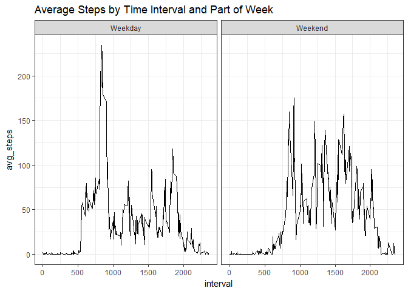

## Loading and preprocessing the data


```r
knitr::opts_chunk$set(echo = TRUE)
library(tidyverse)
```

```
## -- Attaching packages ------------------------------------------------------------- tidyverse 1.2.1 --
```

```
## v ggplot2 2.2.1     v purrr   0.2.4
## v tibble  1.4.2     v dplyr   0.7.4
## v tidyr   0.7.2     v stringr 1.2.0
## v readr   1.1.1     v forcats 0.2.0
```

```
## -- Conflicts ---------------------------------------------------------------- tidyverse_conflicts() --
## x dplyr::filter() masks stats::filter()
## x dplyr::lag()    masks stats::lag()
```

```r
library(lubridate)
```

```
## 
## Attaching package: 'lubridate'
```

```
## The following object is masked from 'package:base':
## 
##     date
```

```r
library(scales)
```

```
## 
## Attaching package: 'scales'
```

```
## The following object is masked from 'package:purrr':
## 
##     discard
```

```
## The following object is masked from 'package:readr':
## 
##     col_factor
```


```r
unzip("activity.zip")

activity <- read_csv('activity.csv')
```

```
## Parsed with column specification:
## cols(
##   steps = col_integer(),
##   date = col_date(format = ""),
##   interval = col_integer()
## )
```

```r
file.remove('activity.csv') ##clean up
```

```
## [1] TRUE
```

Let's make more detailed time variables. I am going to turn the interval column into a more attractive date field and extract the day of the week from the date column.


```r
activity <- activity %>%
  mutate(time = gsub('^([0-9]{2})([0-9]+)$', '\\1:\\2', 
                     str_pad(interval,4,'left','0')),
         weekday = weekdays(date))
```
And here is a look at a sample of the final dataset:


```r
activity %>% sample_n(20)
```

```
## # A tibble: 20 x 5
##    steps date       interval time  weekday  
##    <int> <date>        <int> <chr> <chr>    
##  1   168 2012-10-05     1240 12:40 Friday   
##  2     0 2012-11-03      955 09:55 Saturday 
##  3     0 2012-10-22     2305 23:05 Monday   
##  4     0 2012-11-25     2150 21:50 Sunday   
##  5   404 2012-11-06      700 07:00 Tuesday  
##  6     0 2012-10-14     1810 18:10 Sunday   
##  7     0 2012-11-25     1735 17:35 Sunday   
##  8     0 2012-10-04       55 00:55 Thursday 
##  9     0 2012-11-19      515 05:15 Monday   
## 10     0 2012-11-13      340 03:40 Tuesday  
## 11     0 2012-11-21     1540 15:40 Wednesday
## 12     0 2012-10-26      930 09:30 Friday   
## 13     0 2012-10-22      345 03:45 Monday   
## 14     0 2012-11-18       45 00:45 Sunday   
## 15    NA 2012-11-04      840 08:40 Sunday   
## 16     0 2012-10-19      155 01:55 Friday   
## 17    NA 2012-11-04     1755 17:55 Sunday   
## 18     0 2012-10-14     1950 19:50 Sunday   
## 19     0 2012-10-30     2150 21:50 Tuesday  
## 20     0 2012-10-19       20 00:20 Friday
```


## What is mean total number of steps taken per day?


```r
daily_tot_steps <- activity %>%
  filter(!is.na(steps)) %>%
  group_by(date) %>%
  summarise(total_steps = sum(steps))
```


```r
ggplot(daily_tot_steps, aes(total_steps)) + 
  geom_histogram(bins = 15, fill = 'white', color = 'black') +
  theme_bw() +
  ggtitle('Histogram of Total Steps Per Day')
```

<!-- -->


```r
mean_steps <- mean(daily_tot_steps$total_steps)
med_steps <- median(daily_tot_steps$total_steps)
```

The mean number of steps taken per day is 10766.19 steps.
The median number of steps taken per day is 10765 steps.

## What is the average daily activity pattern?


```r
int_avg_steps <- activity %>%
  filter(!is.na(steps)) %>%
  group_by(time) %>%
  summarise(avg_steps = mean(steps)) %>% 
  ungroup %>%
  mutate(time_factor = 1:nrow(.)) 

max_avg <- int_avg_steps %>%
  filter(avg_steps == max(avg_steps))

int_avg_steps$time <- as_datetime(strptime(int_avg_steps$time, "%H:%M", tz = 'UTC'))

ggplot(int_avg_steps, aes(time, avg_steps)) +
  geom_line() +
  scale_x_datetime(date_labels = "%H:%M") +
  theme_bw() +
  ggtitle('Average Steps by Time Interval')
```

<!-- -->

The time interval with the maximum average number of steps is at 08:35 with 206.17 steps on average.

## Imputing missing values

There are 2304 missing steps records.

When are there missing steps by date, and how many steps records are missing at those dates?


```r
activity %>%
  group_by(date) %>%
  summarise(na_count = sum(is.na(steps))) %>%
  ggplot(aes(date, na_count)) +
  geom_point()
```

<!-- -->

Looks like a few dates are just missing entirely--all 288 time intervals are missing at a few dates. 

Let's quickly fit a smoothed curve to the average steps time series and use that to replace NAs.

I am going to use a LOESS curve with degree two. In order to find a good bandwidth we need to look at a few of the potential options:


```r
bw<-seq(.1, .9, by = .1)

loess_pred <- purrr::map_df(seq_len(9), ~int_avg_steps[,c(3,2)])

loess_pred$bw <- replicate(288, bw) %>% as.vector %>% sort

pred <- NULL

for (i in 1:9) {
  
  curve <- loess(avg_steps ~ time_factor, data= int_avg_steps, span = bw[i])
  
  pred <- c(pred,predict(curve))
  
}

loess_pred$pred <- pred

loess_pred %>%
  mutate(bw = factor(bw)) %>%
  ggplot(aes(x = time_factor)) +
  geom_point(aes(y = avg_steps), alpha = .4, color = 'grey') +
  geom_line(aes(y=pred)) +
  facet_wrap(~bw, ncol = 3 ) +
  theme_bw() +
  ggtitle("LOESS Curve Fit by Bandwidth")
```

<!-- -->

It looks like a span of of 0.3 picks up on some of the large spikes without overfitting. Now let's use that curve to fill in the missing values. It would probably be better practice to use cross validation to choose a span, but this is just a quick fit!


```r
avg_steps <- activity %>%
  filter(!is.na(steps)) %>%
  group_by(time) %>%
  summarise(avg_steps = mean(steps)) %>% 
  ungroup %>%
  mutate(time_factor = 1:nrow(.))

loess_steps <- loess(avg_steps ~ time_factor, data = avg_steps, span = 0.3)
predictions <- predict(loess_steps)

smooth_steps <- avg_steps %>% 
  mutate(smoothed_avg_steps = predictions) %>%
  select(time, smoothed_avg_steps)

activity_nas_replaced <- activity %>% left_join(smooth_steps, by = "time") %>%
  mutate(steps = coalesce(as.double(steps), smoothed_avg_steps))
```

Now that we have replaced the missing values, lets see how things have changed.


```r
daily_tot_steps <- activity_nas_replaced %>% group_by(date) %>%
  summarise(total_steps = sum(steps))

ggplot(daily_tot_steps, aes(total_steps)) + 
  geom_histogram(bins = 15, fill = 'white', color = 'black') +
  theme_bw() +
  ggtitle('Histogram of Total Steps Per Day After Replacing Missing')
```

<!-- -->

```r
mean_steps <- mean(daily_tot_steps$total_steps)
med_steps <- median(daily_tot_steps$total_steps)
```

After replacing the missing values, the mean number of steps taken per day is 10764.37 steps and the median number of steps taken per day is 10752.35 steps. It doesn't look like the results have changed too much!

## Are there differences in activity patterns between weekdays and weekends?

Using that weekday variable we created earlier, let's create an indicator of whether the observed value occured on a weekday or weekend.


```r
activity <- activity %>%
  mutate(part_of_week = if_else(weekday %in% c('Saturday', 'Sunday'), 
                                'Weekend', 'Weekday'))

weekend_ts_data <- activity %>%
  group_by(part_of_week, time) %>%
  summarise(avg_steps = mean(steps, na.rm = TRUE)) %>%
  ungroup

weekend_ts_data$time <- as_datetime(strptime(weekend_ts_data$time, "%H:%M", tz = 'UTC'))

ggplot(weekend_ts_data, aes(time, avg_steps)) +
  geom_line() +
  facet_wrap(~part_of_week) +
  scale_x_datetime(date_labels = "%H:%M") +
  theme_bw() +
  ggtitle('Average Steps by Time Interval and Part of Week')
```

<!-- -->

It looks like there may be a slight difference between the step patterns during the weekdays compared to weekends. The weekend results are volatile, but it would appear that the steps are higher on average and evenly distributed throughout the middle of the day. During the week, the steps appear to be lower on average and are more concentrated early in the day.
